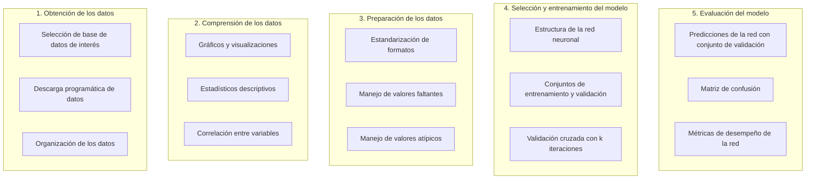

# Diagnóstico de enfermedad cardiaca a partir de variables fisiológicas utilizando redes neuronales

Este proyecto forma parte del módulo de *Machine Learning* del curso de *Data Scientist* de BEDU 2023. El objetivo principal es aplicar las distintas herramientas vistas hasta ahora en el curso para el entrenamiento y validación de un modelo de inteligencia artificial, empleando una base de datos de nuestra elección. 

## Integrantes del equipo
* Cristina Basulto Avila
* Gamaliel Osvaldo Naranjo Bernal
* Víctor Hugo Pérez Núñez
* José Carlos Barreras Maldonado
* Ricardo Iván Carpio Fragoso

## Descripción del proyecto 

Este proyecto tiene como objetivo fundamental desarrollar un modelo de inteligencia artificial basado en redes neuronales tipo perceptrón multicapa para la detección temprana de enfermedades cardiovasculares (ECVs). Dado que las ECVs representan una de las principales causas de mortalidad en todo el mundo, contar con una herramienta precisa y eficaz es esencial para favorecer un diagnóstico temprano. La aplicación exitosa de este modelo tiene el potencial de mejorar las tasas de supervivencia y la calidad de vida de los pacientes, al permitir intervenciones médicas oportunas. 

El proyecto se divide en 5 etapas fundamentales:

## 1. Obtención de los datos

Este proyecto se enfoca en el uso de un conjunto de datos que combina información de 918 pacientes con y sin ECVs. Los datos contienen 11 variables relacionadas con la salud de los pacientes, incluyendo edad, sexo, niveles de colesterol, resultados de electrocardiogramas, frecuencia cardíaca máxima, entre otros.

